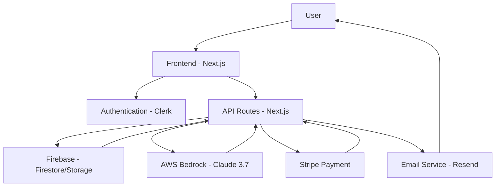

# Coffee Cup Fortune Telling App - Architecture

## Overview

The Coffee Cup Fortune Telling app is built using a modern web architecture that combines several technologies and services to provide a seamless user experience. This document outlines the high-level architecture of the application, including the key components, data flow, and integration points.

## Technology Stack

- **Frontend**: Next.js 15 with React 19, TypeScript, and Tailwind CSS
- **UI Components**: ShadCN UI (based on Radix UI)
- **Authentication**: Clerk
- **Database**: Firebase Firestore
- **Storage**: Firebase Storage
- **AI**: AWS Bedrock with Claude 3.7 Sonnet
- **Payments**: Stripe
- **Email**: Resend
- **Form Validation**: React Hook Form with Zod
- **Styling**: Tailwind CSS with custom theme

## Architecture Diagram

## Component Structure

### Frontend Components

- **Layout Components**
  - `app/layout.tsx`: Main application layout
  - `app/auth/layout.tsx`: Authentication pages layout
  - `app/dashboard/layout.tsx`: Dashboard layout for authenticated users
  - `components/layout/Navbar.tsx`: Navigation bar component

- **Authentication Components**
  - `components/auth/ProtectedRoute.tsx`: Route protection wrapper
  - `app/auth/sign-in/page.tsx`: Sign-in page
  - `app/auth/sign-up/page.tsx`: Sign-up page

- **Fortune Components**
  - `components/fortune/FortuneForm.tsx`: Form for submitting coffee cup images
  - `components/fortune/FortuneResult.tsx`: Display component for fortune results
  - `app/fortune/page.tsx`: Fortune submission page

- **Payment Components**
  - `components/payment/PaymentForm.tsx`: Stripe payment form
  - `app/payment/page.tsx`: Payment page

- **UI Components**
  - Various ShadCN UI components in `components/ui/`

### Backend Services

- **API Routes**
  - `app/api/fortune/route.ts`: Fortune submission endpoint
  - `app/api/fortune/process/route.ts`: Fortune processing endpoint
  - `app/api/payment/route.ts`: Payment processing endpoint
  - `app/api/email/route.ts`: Email sending endpoint

- **Service Modules**
  - `services/bedrock.ts`: AWS Bedrock integration for AI fortune generation
  - `services/stripe.ts`: Stripe integration for payments
  - `services/email.ts`: Email service integration

- **Firebase Integration**
  - `lib/firebase/config.ts`: Firebase client configuration
  - `lib/firebase/admin.ts`: Firebase admin configuration
  - `lib/firebase/utils.ts`: Firebase utility functions
  - `lib/firebase/schema.ts`: Firestore database schema

## Data Flow

### User Registration and Authentication

1. User navigates to the sign-up page
2. User creates an account using Clerk authentication
3. User is redirected to the dashboard
4. Protected routes check authentication status using Clerk middleware

### Fortune Submission Flow

1. User uploads a coffee cup image via the FortuneForm component
2. Image is uploaded to Firebase Storage
3. A new fortune record is created in Firestore with status "pending"
4. User is redirected to the payment page

### Payment Flow

1. User enters payment details in the PaymentForm component
2. Stripe payment intent is created via the payment API
3. Payment is processed using Stripe Elements
4. On successful payment, the fortune status is updated to "processing"

### Fortune Processing Flow

1. After payment, the fortune processing is triggered
2. The coffee cup image is retrieved from Firebase Storage
3. The image is sent to AWS Bedrock (Claude 3.7 Sonnet) for analysis
4. The AI generates a fortune prediction based on the coffee grounds
5. The prediction is stored in Firestore and the status is updated to "completed"
6. An email with the fortune reading is sent to the user

### Fortune Retrieval Flow

1. User navigates to the dashboard to view their fortunes
2. The application fetches the user's fortunes from Firestore
3. Fortunes are displayed in the UI with their status and predictions

## Database Schema

### Firestore Collections

- **users**: User information
  - `id`: Clerk user ID
  - `email`: User's email
  - `firstName`: User's first name (optional)
  - `lastName`: User's last name (optional)
  - `imageUrl`: User's profile image URL (optional)
  - `createdAt`: User creation timestamp
  - `updatedAt`: User update timestamp

- **fortunes**: Fortune readings
  - `id`: Fortune ID
  - `userId`: Clerk user ID
  - `imageUrl`: URL to the uploaded coffee cup image
  - `prediction`: The fortune prediction text
  - `notes`: Additional notes from the user (optional)
  - `createdAt`: Creation timestamp
  - `status`: Fortune status (pending, processing, completed, failed)
  - `paymentId`: Reference to payment document (optional)

- **payments**: Payment information
  - `id`: Payment ID
  - `userId`: Clerk user ID
  - `amount`: Payment amount in cents
  - `currency`: Payment currency
  - `status`: Payment status (pending, succeeded, failed, refunded)
  - `createdAt`: Creation timestamp
  - `updatedAt`: Update timestamp
  - `stripePaymentIntentId`: Stripe payment intent ID
  - `fortuneId`: Reference to fortune document (optional)

## Security

- **Authentication**: Clerk handles user authentication and session management
- **Route Protection**: Middleware ensures only authenticated users can access protected routes
- **Firebase Security Rules**: Rules ensure users can only access their own data
- **Environment Variables**: Sensitive configuration is stored in environment variables
- **API Validation**: Input validation is performed on all API endpoints

## Scalability Considerations

- **Serverless Architecture**: Next.js API routes run as serverless functions
- **Cloud Database**: Firebase Firestore scales automatically
- **Cloud Storage**: Firebase Storage handles image storage
- **Third-party Services**: Clerk, Stripe, AWS Bedrock, and Resend are scalable cloud services

## Future Enhancements

- **Analytics**: Implement analytics to track user behavior and conversion rates
- **A/B Testing**: Test different UI layouts and pricing models
- **Subscription Model**: Implement recurring subscriptions for regular readings
- **Mobile App**: Develop a mobile app using React Native
- **Social Sharing**: Allow users to share their fortunes on social media
- **Multiple Languages**: Support fortune readings in different languages
